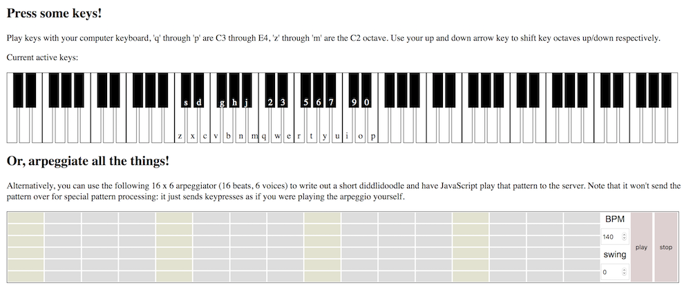

# A simple browser-as-MIDI-keyboard thing

This code relies on [node.js](http://nodejs.org) with [easymidi](https://www.npmjs.com/package/easymidi) to set up a virtual MIDI device, [express](http://expressjs.com/) for acting as a simple server, and [socket.io](http://socket.io/) to let a browser communicate keyup/keydown to the node server so that it can generate the corresponding MIDI events.

The MIDI devide will show up as "Nodejs MIDI out" in any DAW (digital audio workstation) with MIDI device capabilities (for instance, [Reaper](http://www.reaper.fm) or [FL Studio](https://www.image-line.com/flstudio)), so simply select and/or enable it in the list of MIDI inut devices, and start typing in the browser with your keyboard. Load up a virtual instrument for infinite fun (I'm currently messing around with [Eighty Eight Ensemble](http://sonivoxmi.com/products/details/eighty-eight-ensemble-2) by [SONiVOX](http://sonivoxmi.com), which is a 9' steinway piano).

The following keyboard bindings are supported in the browser when focus is on the general document:

```
 2 3   5 6 7   9 0
q w e r t y u i o p
| | | | | | | | | |
C D E F G A B C D E

 s d   g h j
z x c v b n m
| | | | | | |
C D E F G A B
```

Additionally, you can use your left/right arrow keys to shift the input by entire octaves.

To create patterns in the arpeggiator, click a field and then use your keyboard to type the key you want. The arpeggiator will then show the MIDI number for that key based on which octave-set you were in when you typed the key. To clear a field, select it and then press OK with an empty string.

Beats Per Minute is controlled with the BPM number input, as is the swing ratio, for which 0.0 is a straight 4:4 beat, 0.2 is a standard 12:8 jazz swing, 0.5 is "My baby just cares for me" levels of swing, and anything above that (capped at 1.0) is probably more swing than you'll ever need.

## How-to-"this"

Clone and install:

```
$> git clone https://github.com/Pomax/midi-with-node
$> cd midi-with-node
```

Then in order to use things, run the following command:

```
$> npm start
```

(If this is the first time you run `npm start`, this will also install the dependencies that the code relies on.)

This also lets you open [http://localhost:8080](http://localhost:8080) in the browser for generating MIDI events.

Then in your DAW, go to the MIDI device options and find the "Nodejs MIDI out" device and either enable it or add it to your list of active MIDI inputs.

At this point you can do whatever you want in your DAW to set up tracks that are bound to MIDI input, and typing keys in the browser tab for the virtual MIDI device will send MIDI events to your DAW.

## Works out of the box on Linux and OSX, requires one more thing on Windows

This code works because [easymidi](https://www.npmjs.com/package/easymidi) relies on the [midi](https://www.npmjs.com/package/midi) package, which in turn relies on ALSA to create a virtual midi device. That... does not work on Windows, because it uses a completely different audio stack.

To make things work on Windows, you need a MIDI loopback device like [loopmidi](http://www.tobias-erichsen.de/software/loopmidi.html) or [loopbe1](http://nerds.de/en/loopbe1.html) installed. With (either of) those running, create a virtual MIDI device called `NodeJS MIDI out` (technically case insensitive) before running `npm start` and you should be good to go. Easymidi will see the device acting as MIDI I/O based on the name and select that on the `win32` platform (even when you're on x64, because Node uses `win32` as Windows indicator in the same way it uses `darwin` for OSX despite that being a truly ancient OSX at this point).

## Live demo

Not technically live because it needs a Node.js backing, but the web UI can be viewed over on https://pomax.github.io/midi-with-node/public

## Screenshots


